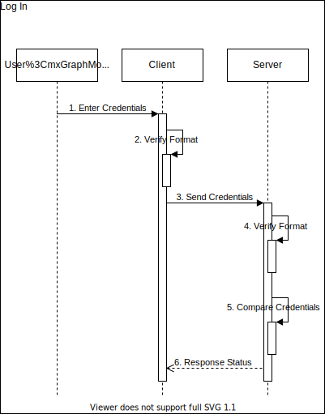

# User Authentication And Authorization

## Topics
* Password Management
  * Log In
  * Sign Up
* Session Cycle
* JWT
* OAuth2.0
* OpenID Connect (OIDC)
## Password Management
----------
### Log In

1. User enters credentials (i.e. username & password).
2. Client side input sanitation.
3. Client makes POST request to server containing user credentials.
4. Server side input sanitation.
5. If user exists, password is combined with salt, hashed and then compared with database password hash.
6. Client is notified of log in status.
### Sign Up

1. User enters profile info (i.e. username, password, email).
2. Client side input sanitation.
3. Client makes POST request to server containing user info.
2. Server side input sanitation.
3. Combine password with salt, and run it through KDF.
4. Store user info in database.
5. Client is notified of sign up status.
## Session Cycle
----------

1. To obtain protected data, client/user needs to be authenticated & authorized.
2. Client provides data needed for authentication.
3. Server reads data, authenticates user & generates session.
4. Session is sent back to client.
5. Client sends session with each request.
## JWT - Json Web Token
----------
Alternative to opaque, statefull tokes used in classic session. Commonly used in WebApis/RESTful services to supply data for Single Page Applications. Send in Authorization header of HTTP request as Bearer token. Data is stored in "payload" portion of a token, and only thing server needs to do, is verify that token has not been edited.
## OAuth2.0
----------

Client web app wants data owned by resource owner, on resource server. To do that client needs to be authorized.
1. Client requests authorization.
2. Authorization server asks RO for credentials.
3. Authorization server asks RO to give authorization grant for client to access data.
4. Client gets authorization code from authorization server.
5. Client exchanges code together with client secret for access token from authorization server on back channel.
6. Client sends requests to resource server with newly obtained access token.
## OpenID Connect
----------
OIDC is built on top of OAuth2.0 to support authentication. Only major differences are that scope has *openid* and that exchanging authorization code gets us access token and user_id token.