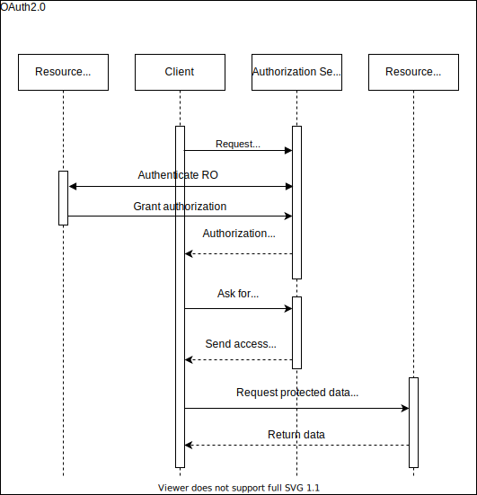

# User Authentication And Authorization
Exploring subjects such as: authentication, authorization, session, jwt, password management, oauth2, oidc, identity server 4

## Diagrams
* Password Management
  * Log In
  * Sign Up
* Session Cycle
  * Generation
  * Verification
* JWT
* OAuth2.0
* OpenID Connect (OIDC)
## Password Management
----------
### Log In

1. User enters credential (i.e. username & password) in form input fields.
2. Client sanitizes & verifies that input is in correct format.
3. Client makes POST request to server with user credentials embedded.
4. Server sanitizes & verifies that input is in correct format.
5. If user exists, password is combined with salt, hashed and then compared with password hash stored in server.
6. Response is sent to client, containing log in status.
### Sign Up

1. User enters required data (i.e. username, password, email) in form input fields.
2. Client sanitizes & verifies that input is in correct format.
3. Client makes POST request to server with user data embedded.
4. Server sanitizes & verifies that input is in correct format.
5. Generate salt for rainbow attack protection.
6. Combine salt & password to generate hash.
7. Store user data without password, salt & password hash in database.
8. Notify client that user account is created.
## Session Cycle
----------

1. To obtain protected data, client/user needs to be authenticated & authorized.
2. Client provides data needed for authentication.
3. Server reads data, authenticates user & generates session.
4. Session is sent back to client.
5. Client sends Session_ID with each request.
## OAuth2.0
----------

Client web application wants to perform actions on data owned by resource owner, on resource server. To do that client needs to be authorized.
1. Client requests authorization.
2. Authorization server asks RO for credentials.
3. When authenticated server asks RO if it wants to give authorization to client.
4. Client gets authorization code from Authorization Server.
5. That code, together with client secret is exchanged for access token in back-end between client & authorization server.
6. Client sends requests to resource server with newly obtained *access token*.